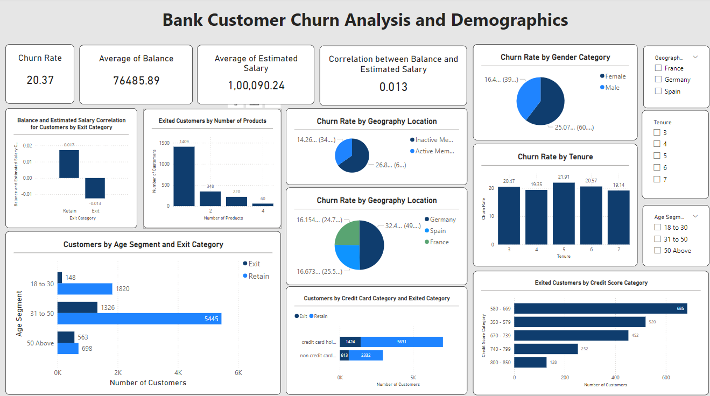

# Bank Customer Behavior and Churn Analysis

## Overview
This repository contains a project that showcases bank customer behavior and churn analysis using SQL and Power BI. The SQL scripts extract and transform data, and the Power BI report visualizes the data to provide insights into sales performance.

## Files
- `reports/Bank_CRM_Project.pbix`: The Power BI Desktop file.
- `data/`: Contains the source data used for the report.
  - `ActiveCustomer.csv`
  - `Bank_Churn.csv`
  - `CreditCard.csv`
  - `CustomerInfo.csv`
  - `ExitCustomer.csv`
  - `Gender.csv`
  - `Geography.csv`
- `sql/`: Contains SQL script for data extraction and transformation.
  - `Bank_CRM_Project.sql`
- `exports/`: Contains exported versions of the report.
  - `Bank_CRM_Project.pdf`
  - `Bank_CRM_Project.png`

## Preview


## How to Use

### Prerequisites
- MySQL Server or compatible database system
- Power BI Desktop

### Steps
1. Clone this repository:
   ```bash
   git clone https://github.com/purna-chandrasekhar/Bank-Customer-Behavior-and-Churn-Analysis.git
